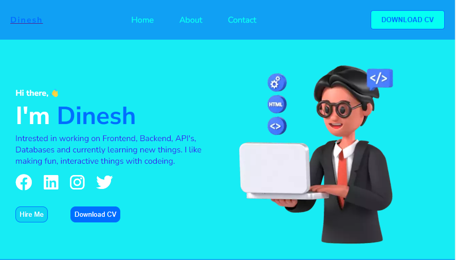

# Dinesh-Portfolio

## Table of Contents

- [Dinesh-Portfolio](#project-title)
- [Description](#description)
- [Demo](#demo)
- [Internship](#internship)
- [Technologies Used](#technologies-used)
- [Features](#features)

## Description

This Portfolio is Build Using HTML (for structureing) & CSS (for styling).This Approach Allows You To Design a Modern and Responsive Portfolio

## Demo

click above image to view the [live preview](https://dineshdevelope.github.io/Dinesh-Portfolio/)

## Internship

This internship is provided by [CyberDude Networks Pvt. Ltd.](https://youtube.com/cyberdudenetworks) as part of the 6-Month Free Internship program, a skill development initiative organized to enhance participants' skills. Mentoring was provided by [Mr. Anbuselvan Rocky](https://instagram.com/anbuselvanrocky). For more information, [you can contact CyberDude Networks here](https://cyberdudenetworks.com).

## Technologies Used

List of technologies, programming languages, and libraries/frameworks used in your project.

<ul>
    <li>HTML</l1>
    <li>CSS</l1>
</ul>

## Features

Below the key features and functionality of your project.

we used `BEM methodology` for class naming and for ensuring a well-structured and maintainable codebase.
